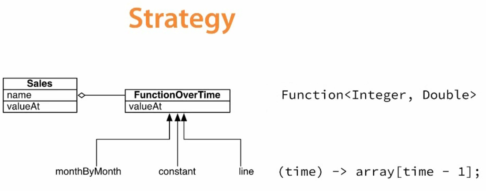

# Functional Programming with Java

- [Functional Programming with Java](#functional-programming-with-java)
  - [0 Interesting Packages for Further Study](#0-interesting-packages-for-further-study)
  - [1 Functions as Values, 1st-class or Higher-order Functions](#1-functions-as-values-1st-class-or-higher-order-functions)
    - [1.1 Enter the Lambda](#11-enter-the-lambda)
    - [1.2 The `@FunctionalInterface` Annotation](#12-the-functionalinterface-annotation)
    - [1.3 Deduplication](#13-deduplication)
    - [1.4 Functions vs Methods](#14-functions-vs-methods)
    - [1.5 Duplication in the small](#15-duplication-in-the-small)
    - [1.6 Type Safety](#16-type-safety)
    - [1.7 Strategy Pattern in a Functional World](#17-strategy-pattern-in-a-functional-world)
  - [2 Example 1 Passing functions as values to remove code duplication](#2-example-1-passing-functions-as-values-to-remove-code-duplication)
    - [2.1 The problem](#21-the-problem)
    - [2.2 Extracting a function](#22-extracting-a-function)
    - [2.3 Code Review 1 - Be specific about the types that are required](#23-code-review-1---be-specific-about-the-types-that-are-required)
    - [2.4 Code Review 2 - Use pure functions](#24-code-review-2---use-pure-functions)
    - [2.5 Encapsulation vs Isolation](#25-encapsulation-vs-isolation)
    - [2.6 Code Review 3 - Test functions](#26-code-review-3---test-functions)
  - [3 Example 2 Separation of concerns](#3-example-2-separation-of-concerns)
    - [3.1 External Iteration vs Internal Iteration](#31-external-iteration-vs-internal-iteration)
    - [3.2 The Example](#32-the-example)
  - [4 Streams](#4-streams)
    - [4.1 How can Streams be more efficient than loops](#41-how-can-streams-be-more-efficient-than-loops)
    - [4.2 Lazy Streams](#42-lazy-streams)
    - [4.3 **When to stop** aka `limit(x)` 👇](#43-when-to-stop-aka-limitx-)
    - [4.4 Stream operations](#44-stream-operations)
    - [4.5 Infinite Streams](#45-infinite-streams)
    - [4.6 Parallel Streams](#46-parallel-streams)
    - [4.7 Terminal operators](#47-terminal-operators)
    - [4.8 Intermediate operators](#48-intermediate-operators)
    - [4.9 Contexts](#49-contexts)
    - [4.10 Optional](#410-optional)
    - [4.11 Playing with Optional](#411-playing-with-optional)
    - [4.12 Monads](#412-monads)

## 0 Interesting Packages for Further Study

- [`java.util.function`](https://docs.oracle.com/en/java/javase/11/docs/api/java.base/java/util/function/package-summary.html)
- [`java.util.stream`](https://docs.oracle.com/en/java/javase/11/docs/api/java.base/java/util/stream/package-summary.html)
- [`java.util.stream.Stream<T>`](https://docs.oracle.com/en/java/javase/11/docs/api/java.base/java/util/stream/Stream.html)
- [`java.util.stream.DoubleStream`](https://docs.oracle.com/en/java/javase/11/docs/api/java.base/java/util/stream/DoubleStream.html)

## 1 Functions as Values, 1st-class or Higher-order Functions

**Functions as Values** means:

1. Store functions in values.
2. Pass functions in parameters.
3. Return functions from other functions.

In Java 6 Objects and Primitives are Values. Java 8 allows Functions (Methods) as Values.

**Functions as Values** are also known as:

- **1st-class Functions**.
- **Higher-order Functions**.

In Java 8 lambdas **ARE NOT** closures:

- Can see nearby variables.
- Cannot change them.

where closures can change nearby variables.

### 1.1 Enter the Lambda

```java
package com.example.functional;

import java.util.function.IntToDoubleFunction;
import java.util.function.Function;
import java.util.function.BiFunction;

public class LambdaExamples {
  public static void Main(final String[] args) {
    IntToDoubleFunction incrementalCosts = time -> 5.1 + 0.15 * time;

    Function<String, Integer> wordCount = s -> s.split(" ").length;

    BiFunction<String, Integer, Boolean> exceedsMaxLength =
      (s, maxLength) -> {
        int actualLength = s.length();
        return actualLength > MaxLength;
      }
  }
}
```

### 1.2 The `@FunctionalInterface` Annotation

The [`@FunctionalInterface`](https://docs.oracle.com/en/java/javase/11/docs/api/java.base/java/lang/FunctionalInterface.html) is an **informative annotation type** used to indicate that an interface type declaration is intended to be a functional interface as defined by the Java Language Specification. Note that instances of functional interfaces can be created with lambda expressions, method references, or constructor references.

```java
package com.example.functional.java8;

@FunctionalInterface
public interface FunctionOverTime {
  double valueAt(int time);
}

public class Implementation {
  final static double[] EXPECTED_SALES_JAN_2_DEC =
    new double[] { 42.0, 45.6, 43.6, 50.2, 55.6, 54.7
                   58.0, 57.3, 62.0, 60.3, 71.2, 88.8 };

  public static void main(final String[] args) {
    final FunctionOverTime sales =
      (time) -> EXPECTED_SALES_JAN_2_DEC[time - 1];
    final FunctionOverTime fixedCosts =
      (time) -> 15.0;
    final FunctionOverTime incrementalCosts =
      (time) -> 5.1 + 0.15 * time;
    final FunctionOverTime profit =
      (time) -> sales.valueAt(time) -
               (incrementalCosts.valueAt(time) +
                fixedCosts.valueAt(time));

    Double totalProfit = 0.0;
    for (int time = 1; time <= 12; time++) {
      totalProfit += profit.valueAt(time);
    }
    System.out.println("Total profits for the year: " + total);
  }
}
```

**BEWARE**: Lambda Expressions have access to values in the surrounding context, so **pretty please** make those values `final`. Example: `EXPECTED_SALES_JAN_2_DEC`.

### 1.3 Deduplication

```java
package com.example.functional.java8;

@FunctionalInterface
public interface FunctionOverTime {
  double valueAt(int time);

  static FunctionOverTime monthByMonth(final double[] values) {
    return time -> values[time - 1];
  }
}

public class Implementation {
  final static double[] EXPECTED_SALES_JAN_2_DEC =
    new double[] { 42.0, 45.6, 43.6, 50.2, 55.6, 54.7
                   58.0, 57.3, 62.0, 60.3, 71.2, 88.8 };

  public static void main(final String[] args) {
    final FunctionOverTime sales =
      FunctionOverTime.monthByMonth(EXPECTED_SALES_JAN_2_DEC);
    final FunctionOverTime fixedCosts =
      (time) -> 15.0;
    final FunctionOverTime incrementalCosts =
      (time) -> 5.1 + 0.15 * time;
    final FunctionOverTime profit =
      (time) -> sales.valueAt(time) -
               (incrementalCosts.valueAt(time) +
                fixedCosts.valueAt(time));

    Double totalProfit = 0.0;
    for (int time = 1; time <= 12; time++) {
      totalProfit += profit.valueAt(time);
    }
    System.out.println("Total profits for the year: " + total);
  }
}
```

What's going on here 👇

```java
@FunctionalInterface
public interface FunctionOverTime {
  double valueAt(int time);

  static FunctionOverTime monthByMonth(final double[] values) {
    return time -> values[time - 1];
  }
}

final FunctionOverTime sales =
      FunctionOverTime.monthByMonth(EXPECTED_SALES_JAN_2_DEC);
```

This requires some step by step explanation:

1. In the `interface`, the static `monthByMonth` function returns a lambda. What's more, returns a **`FunctionOverTime`-like** lambda. This means that `time -> values[time - 1]` needs to match `double valueAt(int time)` or `valueAt :: int -> double`.
2. The Java compiler is smart enough to realize that the body of the lambda expression `values[time - 1]` is the actual implementation of `double valueAt(int time)`.

Now we can go further with our deduplication

```java
package com.example.functional.java8;

@FunctionalInterface
public interface FunctionOverTime {
  double valueAt(int time);

  static FunctionOverTime monthByMonth(final double[] values) {
    return time -> values[time - 1];
  }

  static FunctionOverTime constant(final double value) {
    return time -> value;
  }

  static FunctionOverTime line(final double intercept, final double slope) {
    return time -> intercept + time * slope;
  }
}

public class Implementation {
  final static double[] EXPECTED_SALES_JAN_2_DEC =
    new double[] { 42.0, 45.6, 43.6, 50.2, 55.6, 54.7
                   58.0, 57.3, 62.0, 60.3, 71.2, 88.8 };

  public static void main(final String[] args) {
    final FunctionOverTime sales =
      FunctionOverTime.monthByMonth(EXPECTED_SALES_JAN_2_DEC);
    final FunctionOverTime fixedCosts =
      FunctionOverTime.constant(15.0);
    final FunctionOverTime incrementalCosts =
      FunctionOverTime.line(5.1, 0.15);
    final FunctionOverTime profit =
      (time) -> sales.valueAt(time) -
               (incrementalCosts.valueAt(time) +
                fixedCosts.valueAt(time));

    Double totalProfit = 0.0;
    for (int time = 1; time <= 12; time++) {
      totalProfit += profit.valueAt(time);
    }
    System.out.println("Total profits for the year: " + total);
  }
}
```

How can we go further and express that `constant` and `line` are 2 special cases of `polynomial`?

```java
package com.example.functional.java8;

@FunctionalInterface
public interface FunctionOverTime {
  double valueAt(int time);

  static FunctionOverTime monthByMonth(final double[] values) {
    return time -> values[time - 1];
  }

  static FunctionOverTime constant(final double value) {
    return polynomial(new Double[] { value });
  }

  static FunctionOverTime line(final double intercept, final double slope) {
    return polynomial(new Double[] { intercept, slope };
  }

  static FunctionOverTime polynomial(final double[] coefficients) {
    return time -> {
      Double sum = 0.0;
      for (int i = 0; i < coefficients.length; i++) {
        sum += Math.pow(time, i) * coefficients[i];
      }
      return sum;
    }
  }
}
```

Instead of a blurry **IS-A** relationship in **OO**:

- `constant` **IS-A** `polynomial`,
- `line` **IS-A** `polynomial`)

we have a much more flexible **USES-A** relationship in **FP**:

- `constant` **USES-A** `polynomial`,
- `line` **USES-A** `polynomial`)

### 1.4 Functions vs Methods

- `static` methods, like functions, are not attached to an instance of a class.
- Evaluation has **NO** outside effect (**referential transparency** or **pure functions**).

So, we should expect that `static` methods and `@FunctionalInterface`s behave in a pure function data-in-data-out way.

The **only exception** is the `Consumer<T>` interface which is marked as `@FunctionalInterface`, **cause side-effects and returns `void`**.

### 1.5 Duplication in the small

There's still some duplication in the `profit` function with 3 calls to `valueAt` 👇

```java
final FunctionOverTime profit =
  (time) -> sales.valueAt(time) -
           (incrementalCosts.valueAt(time) +
            fixedCosts.valueAt(time));
```

What we really want to say here is that `profit` is a combination of 3 other quantities:

- `sales`,
- `incrementalCosts`,
- `fixedCosts`,

and how they are related in a predetermined way (a sum and a substraction).

```java
final FunctionOverTime profit =
  FunctionOverTime.combinationOf3(
    sales,
    incrementalCosts,
    fixedCosts,
    (s, ic, fc) -> s - ic + fc
  );
```

We need to implement `combinationOf3` as another `static` member in `FunctionOverTime`. We also need an `apply` function in a `Functionof3` interface to model the 4th argument to `combinationOf3`.

```java
package com.example.functional.java8;

@FunctionalInterface
public interface FunctionOverTime {
  double valueAt(int time);

  ...

  @FunctionalInterface
  static interface FunctionOf3 {
    double apply(double a, double b, double c);
  }

  static FunctionOverTime CombinationOf3(
    final FunctionOverTime a,
    final FunctionOverTime b,
    final FunctionOverTime c,
    final FunctionOf3 f
  ) {
    return time -> f.apply(
      a.valueAt(time),
      b.valueAt(time),
      c.valueAt(time)
    );
  }
```

We have separated:

- getting the values out of the inputs

from

- doing the math on those values.

### 1.6 Type Safety

Right now we could switch `FixedCosts` with `IncrementalCosts` because there's no type safety at all. We need to restore that type safety but without the big inheritance hierarchy of Object Oriented Programming.

`QuantityOfInterest.java`

```java
package com.example.functional.java8;

public interface QuantityOfInterest {
  String getName();
  double valueAt(final int time);
}
```

`Sales.java`

```java
package com.example.functional.java8;

public class Sales implements QuantityOfInterest {
  private final FunctionOverTime valueFunction;

  public Sales(FunctionOverTime valueFunction) {
    this.valueFunction = valueFunction;
  }

  public String getName() {
    return "Sales";
  }

  public double valueAt(int time) {
    return valueFunction.valueAt(time);
  }
}
```

`FixedCosts.java`

```java
package com.example.functional.java8;

public class FixedCosts implements QuantityOfInterest {
  private final FunctionOverTime valueFunction;

  public FixedCosts(FunctionOverTime valueFunction) {
    this.valueFunction = valueFunction;
  }

  public String getName() {
    return "Fixed Costs";
  }

  public double valueAt(int time) {
    return valueFunction.valueAt(time);
  }
}
```


`IncrementalCosts.java`

```java
package com.example.functional.java8;

public class IncrementalCosts implements QuantityOfInterest {
  private final FunctionOverTime valueFunction;

  public IncrementalCosts(FunctionOverTime valueFunction) {
    this.valueFunction = valueFunction;
  }

  public String getName() {
    return "Incremental Costs";
  }

  public double valueAt(int time) {
    return valueFunction.valueAt(time);
  }
}
```

It's important to notice that the repetition between `Sales`, `FixedCosts` and `IncrementalCosts` is the price we need to pay in Java to have **functional and type safety** at the same time.

`Profit.java`

```java
package com.example.functional.java8;

public class Profit implements QuantityOfInterest {
  private final Sales sales;
  private final IncrementalCosts incrementalCosts;
  private final FixedCosts fixedCosts;

  public Profit(Sales s, IncrementalCosts ic, FixedCosts fc) {
    this.sales = s;
    this.incrementalCosts = ic;
    this.fixedCosts = fc;
  }

  public String getName() {
    return "Profit!!!";
  }

  public double valueAt(int time) {
    return sales.valueAt(time) -
          (incrementalCosts.valueAt(time) +
           fixedCosts.valueAt(time));
  }
}
```

The formula for `Profit` is a business rule and belongs there, inside `valueAt`.

We need to change our `main` method yet again

`Implementation.java`

```java
package com.example.functional.java8;

public class Implementation {
  final static double[] EXPECTED_SALES_JAN_2_DEC =
    new double[] { 42.0, 45.6, 43.6, 50.2, 55.6, 54.7
                   58.0, 57.3, 62.0, 60.3, 71.2, 88.8 };

  public static void main(final String[] args) {
    final Sales sales = new Sales(
      FunctionOverTime.monthByMonth(EXPECTED_SALES_JAN_2_DEC)
    );

    final FixedCosts fixedCosts = new FixedCosts(
      FunctionOverTime.constant(15.0)
    );

    final IncrementalCosts incrementalCosts = new IncrementalCosts(
      FunctionOverTime.line(5.1, 0.15)
    );

    final Profit profit = new Profit(
      sales,
      incrementalCosts,
      fixedCosts
    );

    Double totalProfit = 0.0;
    for (int time = 1; time <= 12; time++) {
      totalProfit += profit.valueAt(time);
    }
    System.out.println("Total profits for the year: " + total);
  }
}
```

### 1.7 Strategy Pattern in a Functional World

We are back to one class per quantity but with no deep inheritance hierarchy. Now, each one (`Sales`, `FixedCosts` and `IncrementalCosts`) calculates its own value which is composition in the Object-oriented sense....

But wait, that's also the **Strategy Pattern**.




## 2 Example 1 Passing functions as values to remove code duplication

### 2.1 The problem

`TimingProblem.java`

```java
package com.example.measures;

import java.util.Random;

public class TimingProblem {
  public static void main(final String[] args) {
    final Double costs = calculateCosts();
    final Double revenue = calculateRevenue();
    final Double profit = calculateProfit(costs, revenue);

    System.out.println("Profit = $" + profit);
  }

  private static Double calculateCost() {
    pretendToWorHard();
    return 4567.3;
  }

  private static Double calculateRevenue() {
    pretendToWorkHard();
    return 23413.2;
  }

  private static Double calculateProfit(Double costs, Double revenue) {
    pretendToWorkHard();
    return revenue - costs;
  }

  private static final Random r = new Random();
  private static final Integer MAX_WORK_TIME_MS = 2000;
  private static void pretendToWorkHard() {
    try {
      Thread.sleep(r.nextInt(MAX_WORK_TIME_MS));
    } catch (InterruptedException e) {
      System.out.println(e.getMessage());
    }
  }
}
```

How can we time the different operations for profiling? Well... with a lot of duplication 👇

`TimingProblem.java`

```java
package com.example.measures;

import java.util.Date;
import java.util.Random;

public class TimingProblem {
  public static void main(final String[] args) {

    final Date beforeCosts = new Date();
    final Double costs = calculateCosts();
    final Long costMillis = new Date().getTime() - beforeCosts.getTime();
    System.out.println(
      "Costs calculation took " + costMillis + " millis"
    );

    final Date beforeRevenue = new Date();
    final Double revenue = calculateRevenue();
    final Long revenueMillis = new Date().getTime() - beforeRevenue.getTime();
    System.out.println(
      "Revenue calculation took " + costMillis + " millis"
    );

    final Date beforeProfit = new Date();
    final Double profit = calculateProfit(costs, revenue);
    final profitMillis = new Date().getTime() - beforeProfit.getTime();
    System.out.println(
      "Profit calculation took " + costMillis + " millis"
    );

    System.out.println("Profit = $" + profit);
  }

  ...
}
```

### 2.2 Extracting a function

Isolate the parts that are the same into a single function and pass the parts that are different as parameters.

`Timing.java`

```java
package com.example.measures;

import java.util.Date;
import java.util.function.Supplier;

public class Timing {
  public static Double timed(String description, Supplier<Double> code) {
    final Date before = new Date();
    Double result = code.get();
    final Long duration = new Date().getTime() - before.getTime();
    System.out.println(
      description + " took " + duration + " millis"
    );

    return result;
  }
}
```

- [`Supplier<T>`](https://docs.oracle.com/en/java/javase/11/docs/api/java.base/java/util/function/Supplier.html): returns an object and it doesn't need any parameter.

`TimingProblem.java`

```java
package com.example.measures;

import java.util.Random;
import static com.example.measures.Timing.timed;

public class TimingProblem {
  public static void main(final String[] args) {

    final Double costs = timed(
      "Costs calculation",
      TimingProblem::calculateCosts()
    );

    final Double revenue = timed(
      "Revenue calculation",
      TimingProblem::calculateRevenue
    );

    final Double profit = timed(
      "Profit calculation",
      () -> calculateProfit(costs, revenue)
    );

    System.out.println("Profit = $" + profit);
  }

  ...
}
```

> The `import static` declaration is analogous to the normal `import` declaration. Where the normal `import` declaration imports classes from packages, allowing them to be used without package qualification, the `import static` declaration imports static members from classes, allowing them to be used without class qualification.

- **Java 8 Method Reference**: A method reference is the shorthand syntax for a lambda expression that executes just ONE method.

| Method references               | Lambdas                  |
|---------------------------------|--------------------------|
| `TimingProblem::calculateCosts` | `() -> calculateCosts()` |

### 2.3 Code Review 1 - Be specific about the types that are required

We can fix this issue with **Generics**.

`Timing.java`

```java
package com.example.measures;

import java.util.Date;
import java.util.function.Supplier;

public class Timing {
  public static <A> A timed(String description, Supplier<A> code) {
    final Date before = new Date();
    A result = code.get();
    final Long duration = new Date().getTime() - before.getTime();
    System.out.println(
      description + " took " + duration + " millis"
    );

    return result;
  }
}
```

### 2.4 Code Review 2 - Use pure functions

The `static` function `timed` is explicitly using `System.out.println` making the assumption that it is runned somewhere the console output is useful.

`Timing.java`

```java
package com.example.measures;

import java.util.Date;
import java.util.function.Consumer;
import java.util.function.Supplier;

public class Timing {
  public static <A> A timed(String description,
                            Supplier<A> code
  ) {
    Consumer<String> defaultOutput = System.out::println;
    return timed (description, defaultOutput, code);
  }

  public static <A> A timed(String description,
                            Consumer<String> output,
                            Supplier<A> code
  ) {
    final Date before = new Date();
    A result = code.get();
    final Long duration = new Date().getTime() - before.getTime();
    output.accept(
      description + " took " + duration + " millis"
    );

    return result;
  }
}
```

- [`Consumer<T>`](https://docs.oracle.com/en/java/javase/11/docs/api/java.base/java/util/function/Consumer.html): represents an operation that accepts a single input argument and returns no result. Unlike most other functional interfaces, Consumer is expected to operate via side-effects.

### 2.5 Encapsulation vs Isolation

- **Encapsulation**: Hiding the inner workings of our classes from the outside world
- **Isolation**: I don't want my function to know anything about the outside world.

### 2.6 Code Review 3 - Test functions

`TimingTest.java`

```java
package com.example.measures;

import org.junit.Test;
import java.util.concurrent.atomic.AtomicReference;

public class TimingTest {
  @Test
  public void testTimed() throws Excecption {
    final String description = "Supply carrot";
    AtomicReference<String> output = new AtomicReference<>();

    Timing.timed(
      description,
      output::get,
      () -> "carrot"
    );

    assert(
      output.get().contains(description)
    );
  }
}
```

For this `test` the outside world is an Atomic Reference. Using an [`AtomicReference<V>`](https://docs.oracle.com/en/java/javase/11/docs/api/java.base/java/util/concurrent/atomic/AtomicReference.html) means that this code will run safely even if something inside the `timed` function offloads the calculation to a different thread. It points out what's allowed to change, only the value in the `AtomicReference` (`output`).

## 3 Example 2 Separation of concerns

### 3.1 External Iteration vs Internal Iteration

Let's consider 2 different ways of going over a list, `filter` vs `for`:

```java
final Stream<String> nonEmpties =
  Arrays
    .asList(descriptions)
    .stream()
    .filter(description -> !description.isEmpty())
```

vs

```java
final List<String> lastWords = new ArrayList<>();
for (String description : nonEmpties) {
  lastwords.add(lastWord(description));
}
```

In the 1st one (**internal iteration**) `Stream` is in control (through `filter`) whereas in the 2nd one (**external iteration**) the programmer is in control (she can stop the loop when she wants).

External iteration with `for` is syntatic sugar for

```java
final List<String> lastWords = new ArrayList<>();
Iterator<String> it = nonEmpties.iterator();
while (it.hasNext()) {
  String description = it.next();
  lastWords.add(lastWord(d));
}
```

Functional programming favors **internal iteration** (declarative) over **external tteration**:

- More readable `=` More declarative
- More readable `!=` More familiar

Internal Iteration 👇

| Guava (Java 6)  | Java 8  |
|-----------------|---------|
| FluentIterable  | Stream  |
| filter          | filter  |
| transform       | map     |
| Joiner          | reduce  |

### 3.2 The Example

`CollectionsExample.java`

```java
package com.example.collections;

import java.util.Arrays;
import java.util.function.Function;
import java.util.stream.Stream;

public class CollectionsProblem {
  final static String[] food = new String[] {
    "Crunchy carrots",
    "Golden-hued bananas",
    "",
    "Bright orange pumpkins",
    "Little trees of broccoli",
    "meat"
  };

  private static String summarize(final String[] descriptions) {
    return Arrays
      .asList(descriptions)
      .stream()
      .filter(d -> !d.isEmpty())
      .map(lastWord)
      .reduce((words, nextWord) -> words + " & " + nextWord)
      .orElse("");
  }

  private static Function<String, String> lastWord =
    phrase ->
      Arrays
        .asList(phrase.split(" "))
        .stream()
        .reduce((acc, next) -> next)
        .orElse("");


  public static void main(final String[] args) {
    final String summary = summarize(food);
    System.out.println(summary);

    /* TEST */
    final String desiredSummary =
      "carrots & bananas & pumpkins & broccoli & meat";
    if (summary.equals(desiredSummary)) System.out.println("yay!");
  }
}
```

Interesting docs:

- [`java.util.stream.Stream.filter`](https://docs.oracle.com/en/java/javase/11/docs/api/java.base/java/util/stream/Stream.html#filter(java.util.function.Predicate))
- [`java.util.stream.Stream.forEach`](https://docs.oracle.com/en/java/javase/11/docs/api/java.base/java/util/stream/Stream.html#forEach(java.util.function.Consumer))
- [`java.util.stream.Stream.map`](https://docs.oracle.com/en/java/javase/11/docs/api/java.base/java/util/stream/Stream.html#map(java.util.function.Function))
- [`java.util.stream.Stream.reduce`](https://docs.oracle.com/en/java/javase/11/docs/api/java.base/java/util/stream/Stream.html#reduce(java.util.function.BinaryOperator))
- [`java.util.Optional<T>`](https://docs.oracle.com/en/java/javase/11/docs/api/java.base/java/util/Optional.html)
- [`java.util.Optional.orElse`](https://docs.oracle.com/en/java/javase/11/docs/api/java.base/java/util/Optional.html#orElse(T))

## 4 Streams

- A Stream is a context.

### 4.1 How can Streams be more efficient than loops

Even though we are expressing 3 different operations over the collection (`filter`, then `map`, then `reduce`), the `Stream` is iterating over the collection **only once** to do these 3 operations 👇

```java
final static String[] food = new String[] {
  "Crunchy carrots",
  "Golden-hued bananas",
  "",
  "Bright orange pumpkins",
  "Little trees of broccoli",
  "meat"
};

private static String summarize(final String[] descriptions) {
  return Arrays.asList(descriptions).stream()
    .peek(d -> System.out.println("About to filter: " + d))
    .filter(d -> !d.isEmpty())
    .peek(d -> System.out.println("About to map: " + d))
    .map(lastWord)
    .peek(d -> System.out.println("About to reduce: " + d))
    .reduce((words, nextWord) -> words + " & " + nextWord)
    .orElse("");
}
```


### 4.2 Lazy Streams


The internal iteration provided by Streams is **lazy** in nature. It only pulls a value once it can be fully processed by the complete chain.

### 4.3 **When to stop** aka `limit(x)` 👇

```java
private static String summarize(final String[] descriptions) {
  return Arrays.asList(descriptions).stream()
    .filter(d -> !d.isEmpty())
    .limit(3)
    .map(lastWord)
    .reduce((words, nextWord) -> words + " & " + nextWord)
    .orElse("");
}
```

Separation of concerns:

- What to do
- When to stop

### 4.4 Stream operations

`Sale.java`

```java
package com.example.sales;

import java.util.Date;
import java.util.List;
import java.util.Optional;

public class Sale {
  final public Store store;
  final public Date date;
  final public Optional<String> customer;
  final public List<Item> items;

  public Sale(
    Store store,
    Date date,
    Optional<String> customer,
    List<Item> items
  ) {
    this.store = store;
    this.date = date;
    this.customer = customer;
    this.items = items;
  }

  public double total() {
    return
      items.stream()
        .mapToDouble(item -> item.price)
        .sum();
  }
}
```

`TodaySales.java`

```java
package com.example.sales;

import java.util.*;
import java.util.function.*;
import java.util.stream.*;

public class TodaySales {
  static final List<Sale> sales = Arrays.asList(
    new Sale(
      Store.KANSAS_CITY,
      new Date(),
      Optional.of("Sarah"),
      Arrays.asList(
        new Item("carrot", 12.00)
      )
    ),
    new Sale(
      Store.ST_LOUIS,
      new Date(),
      Optional.empty(),
      Arrays.asList(
        new Item("carrot", 12.00),
        new Item("lizard", 99.99),
        new Item("cookie", 1.99)
      )
    ),
    new Sale(
      Store.ST_LOUIS,
      new Date(),
      Optional.of("Jamie"),
      Arrays.asList(
        new Item("banana", 3.49),
        new Item("cookie", 1.49)
      )
    )
  );

  static Stream<Sale> saleStream() {
    return sales.stream();
  }

  public static void main(final String[] args) {
    /* How many sales? */
    long saleCount = saleStream().count();
    System.out.println("Count of sales: " + saleCount);

    /* Any sales over $100? */
    boolean bigSaleDay = saleStream.anyMatch(sale -> sale.total() > 100.00);
    System.out.println("Big sale day? " + bigSaleDay);

    /* Maximum sale amount? */
    DoubleSummaryStatistics stats =
      saleStream()
        .mapToDouble(Sale::total)
        .summaryStatistics();
    System.out.println("Max sale amount: " + stats.getMax());
    System.out.println("Stats on total: " + stats);

    /* itemStream Supplier */
    Supplier<Stream<Item>> itemStream = () ->
      saleStream()
        .flatMap(sale -> sale.items.stream());

    /* How many items were sold today? */
    long itemCount =
      itemStream.get()
        .count();
    System.out.println("Count of items: " + itemCount);

    /* How many different items were sold today? */
    long uniqueItemCount =
      itemStream.get()
        .map(item -> item.identity)
        .distinct()
        .count();
    System.out.println("Count of distinct items: " + uniqueItemCount);

    /* Which different items were sold today? v1 */
    List<String> uniqueItemsv1 =
      itemStream.get()
        .map(item -> item.identity)
        .distinct()
        .collect(Collectors.toList());
    System.out.println("Distinct items: " + uniqueItemsv1);

    /* Which different items were sold today? v2 */
    String uniqueItemsv2 =
      itemStream.get()
        .map(item -> item.identity)
        .distinct()
        .collect(Collectors.joining(" & "));
    System.out.println("Distinct items: " + uniqueItemsv2);

    /* Summarize sales by store v1 😱🤪 */
    Map<Store, DoubleSummaryStatistics> summary =
      saleStream()
        .collect(
          Collectors.groupingBy(
            sale -> sale.store,
            Collectors.summarizingDouble(Sale::total)
          )
        );
    System.out.println("Summary by store: " + summary);
    summary.keySet().stream()
      .forEach(store -> System.out.println(store + " stats: " + summary.get(store)));
  }
}
```

### 4.5 Infinite Streams

```java
package com.example.sales.random;

import com.example.sales.*;

import java.util.Optional;
import java.util.function.Supplier;
import java.util.stream.Stream;

public class RandomSale {

  /*
   * From a source of values - suppliers
   * we can create an infinite stream with a
   * short circuiting intermediate operation like `limit`
   * to make the infinite stream useful
   */
  public static Stream<Sale> streamOf(long quantity) {
    return
      Stream
        .generate(supplier)
        .limit(quantity);
  }

  /* A `suplier` can make a `sale` out of nowhere */
  public static Supplier<Sale> supplier =
    () -> new Sale(
      pickAStore(),
      new Date(),
      pickACustomer(),
      randomListOfItems()
    );
}
```

`TodaySales.java`

```java
package com.example.sales;

import java.util.*;
import java.util.function.*;
import java.util.stream.*;

public class TodaySales {
  ...

  /* Pull of a stream of 100 random sales */
  static Stream<Sale> saleStream() {
    return RandomSale.streamOf(100);
  }

  ...
}
```

Infinite streams are only useful if there is a **short circuiting operation** somewhere in the pipeline:

- `anyMatch` (short circuiting terminal operation)
- `limit` (short circuiting intermediate operation)


### 4.6 Parallel Streams

```java
package com.example.sales.random;

import com.example.sales.*;
import static com.example.sales.random.RandomUtil.*;

import java.util.Date;
import java.util.List;
import java.util.Optional;
import java.util.Random;
import java.util.function.Supplier;
import java.util.stream.Collectors;
import java.util.stream.Stream;

public class RandomSale {

  /*
   * From a source of values - suppliers
   * we can create an infinite stream with a
   * short circuiting intermediate operation like `limit`
   * to make the infinite stream useful
   */
  public static Stream<Sale> streamOf(long quantity) {
    return
      Stream
        .generate(supplier)
        .limit(quantity);
  }

  /* A `suplier` can make a `sale` out of nowhere */
  public static Supplier<Sale> supplier =
    () -> new Sale(
      pickAStore(),
      new Date(),
      pickACustomer(),
      randomListOfItems()
    );


  private static Random random = new Random();

  private static final int MAX_ITEMS = 6;
  private static List<Item> randomListOfItems() {
    int howMany = random.nextInt(MAX_ITEMS - 1) + 1;
    return RandomItems.infiniteStream()
            .limit(howMany)
            .collect(Collectors.toList());
  }

  private static final Double PERCENT_NO_CUSTOMER = 0.25;
  private static final String[] CUSTOMERS =
          new String[] { "Wilma", "Betty", "Fred", "Barney", "Dino"};
  private static Optional<String> pickACustomer() {
    if (random.nextDouble() < PERCENT_NO_CUSTOMER) {
      return Optional.empty();
    } else {
      return Optional.of(randomElement(CUSTOMERS));
    }
  }


  private static Store pickAStore() {
    return randomElement(Store.values());
  }
}
```

`TodaySales.java`

```java
package com.example.sales;

import java.util.*;
import java.util.function.*;
import java.util.stream.*;

public class TodaySales {
  ...

  /* Pull of a stream of 100000 random sales */
  static Stream<Sale> saleStream() {
    return RandomSale.streamOf(100_000);
  }

  public static void main(final String[] args) {
    ...

    /* Summarize sales by store v2 (parallel) 🤪😱🤪 */
    ConcurrentMap<String, DoubleSummaryStatistics> summary =
      saleStream()
        .parallel()
        .collect(
          Collectors.groupingByConcurrent(
            sale -> Thread.currentThread().getName(),
            Collectors.summarizingDouble(Sale::total)
          )
        );

    System.out.println("Summary by thread: " + summary);
    summary.keySet().stream()
      .sorted()
      .forEach(
        thread -> System.out.println(thread + " stats: " + summary.get(thread))
      );
}
```

Infinite streams are only useful if there is a **short circuiting operation** somewhere in the pipeline:

- `anyMatch` (short circuiting terminal operation)
- `limit` (short circuiting intermediate operation)

### 4.7 Terminal operators

**Terminal operators** trigger the processing on the stream to happen:

- `reduce`
- `sum`
- `anyMatch`
- `summaryStatistics`

Terminal operators:

- Return a value.
- Terminate the Stream instance.

`Streams`, like `Iterators`, provide **ONLY** a one-time traversal. That's why we need this function

```java
static Stream<Sale> saleStream() {
  return sales.stream();
}
```

With a `Supplier` we can also get a Stream more than once

```java
Supplier<DoubleStream> totalStream = () ->
  saleStream().mapToDouble(Sale::total);

totalStream.get().summaryStatistics();
```

### 4.8 Intermediate operators

**Intermediate operators** trigger no processing on the stream:

- `filter`
- `map`
- `flatMap`
- `distinct`

Intermediate operators:

- Return a Stream.
- let you keep going.

### 4.9 Contexts

A `Stream` is a **context** (ehem... a **Monad**). Another Cont... Monad is `Optional` which holds zero or one value (Maybe Monad?).

### 4.10 Optional

[`Optional`](https://docs.oracle.com/en/java/javase/11/docs/api/java.base/java/util/Optional.html) is a container object which may or may not contain a non-null value:

- If a value is present, `isPresent()` returns `true`.
- If no value is present, `isPresent()` returns `false` and the object is considered empty.

Additional methods that depend on the presence or absence of a contained value are provided, such as `orElse()` (returns a default value if no value is present) and `ifPresent()` (performs an action if a value is present).

This is a value-based class; use of identity-sensitive operations (including reference equality (`==`), identity hash code, or synchronization) on instances of `Optional` may have unpredictable results and should be avoided.

`Optional` is primarily intended for use as a **method return type** where there is a clear need to represent _no result_, and where using `null` is likely to cause errors. A variable whose type is `Optional` should never itself be `null`; it should always point to an `Optional` instance.

### 4.11 Playing with Optional

```java
package com.example.optionals;

public class OptionalExample {
  public static void main() {
    System.out.println(
      "Who bought a carrot? " + carrotCustomer().orElse("I can't say")
    );
  }

  static Stream<Sale> saleStream() {
    return RandomSale.streamOf(3);
  }

  static Optional<Sale> findSaleOf(String itemName) {
    return
      saleStream()
        .filter(sale.items.stream()
          .anyMatch(item -> item.identity.equals(itemName)))
        .findFirst()
  }

  /* Give me the store that sold a "carrot" */
  static Optional<Store> carrotStore() {
    return
      findSaleOf("carrot")
        .map(sale -> sale.store);
  }

  /* Give me the customer who bought a "carrot" */
  /* 😱😱😱 Enter the Monad 😱😱😱             */
  /* The story of Optional<Optional<String>>    */
  static Optional<Store> carrotCustomer() {
    return
      findSaleOf("carrot")
        .flatMap(sale -> sale.customer)
  }
}
```

- [`java.util.stream.Stream.findFirst()`](https://docs.oracle.com/en/java/javase/11/docs/api/java.base/java/util/stream/Stream.html#findFirst()): Returns an `Optional` describing the first element of this stream, or an empty `Optional` if the stream is empty. This is a short-circuiting terminal operation.

From an architectural standpoint:

- The `main` method represents the User Interface.
- Only in the `main` method we need to consider **_what if there is no data_** with `orElse`.
- `carrotStore` and `carrotCustomer` are the Data Layer.
- In the Data Layer (`map`, `flatMap`) if no data was found we need to do nothing (NO `null` checking), `Optional` does it for us and only in the `main` method we need to care.

### 4.12 Monads

Any context with `map`, `flatMap` and some kind of wrapping constructor like `of` (`Stream.of` or `Optional.of`) is a Monad.
